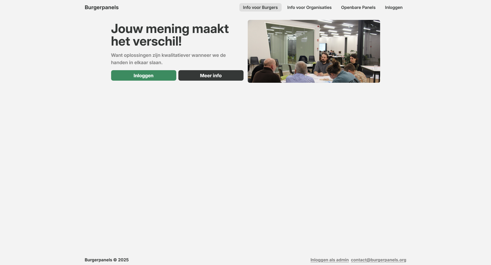

## Burgerpanels.org: Citizen Panel Platform

Burgerpanels.org is a platform designed to support the setup and management of randomly selected citizen panels. Built with .NET, Entity Framework Core, PostgreSQL, TypeScript, and Tailwind CSS, it offers a multi-tenant environment for governments, municipalities, and organizations to facilitate citizen participation in policy-making.

### Partners

- **De Wakkere Burger:** Strengthens citizen participation and fair representation via citizen panels.  
- **Tree Company:** Develops digital tools to engage citizens on social issues.
- **G1000:** Advocates for institutionalized participatory methods like citizen panels.  
- **Levuur:** Specializes in co-creation and stakeholder engagement for societal challenges.

### Goals

Provide an accessible, end-to-end platform to facilitate citizen panels with reduced complexity, especially benefiting smaller municipalities and organizations.

### Features

- User roles: Admin, Organization, Panel Member, Citizen  
- Informative content and guided concept exploration  
- Customizable panel processes  
- Panel execution: recruitment, facilitation, communication, evaluation, follow-up

### Technical Details

- Microsoft .NET + EF Core + PostgreSQL backend  
- TypeScript & Tailwind CSS frontend  
- Multi-tenant architecture  
- Responsive design, cloud deployment, monitoring, security

