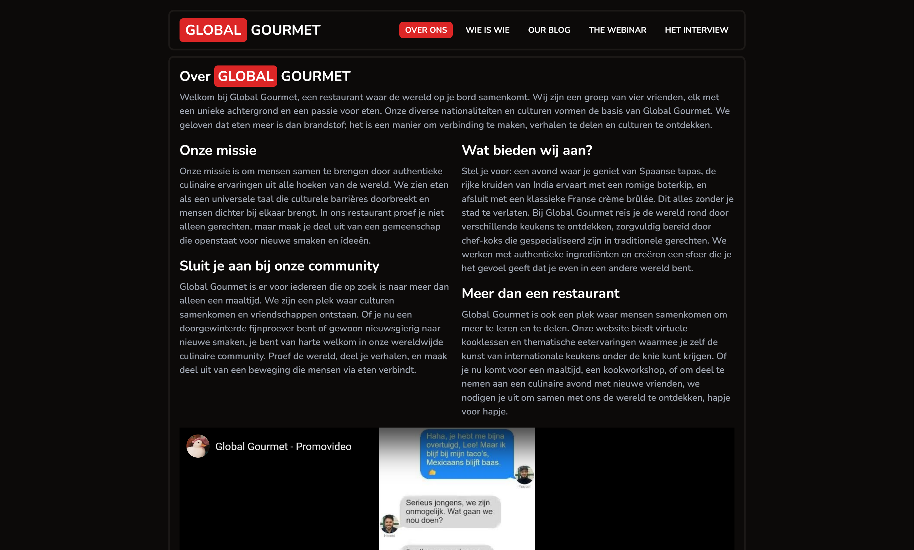

**Global Gourmets** is a collaborative web project developed by a team of four students, including myself, during our second year at [KdG University of Applied Sciences and Arts](https://www.kdg.be/en). This project was part of the **Communications 2** course, aiming to create a dynamic platform that explores global cuisines and cultural food stories.

### Technologies Used

Here’s the markdown source for the list with links:

- **[Vue.js](https://vuejs.org/)**: Utilized for building a reactive and component-based user interface.  
- **[Tailwind CSS](https://tailwindcss.com/)**: Employed for efficient and responsive styling using utility-first classes.  
- **[Nunito](https://fonts.google.com/specimen/Nunito)**: Selected as the primary typeface for its readability and modern aesthetic.  
- **[PocketBase](https://pocketbase.io/)**: Implemented as a lightweight and easy-to-use database based on SQLite.  
- **[Cloudflare Pages](https://pages.cloudflare.com/)**: Chosen for deploying the site, ensuring fast and reliable global access.

### Project Overview

The website features a collection of articles and blog posts that delve into various aspects of global gastronomy. Topics range from the influence of cultures on world dishes to the journey of ingredients from farm to table. The content is designed to be engaging and informative, catering to food enthusiasts and curious readers alike.

### Explore the Project

- **Live Website**: [gg.niceduck.dev](https://gg.niceduck.dev/)
- **Project Overview by Team Member**: [niceduck.dev](https://niceduck.dev/projects/global-gourmet/)

Feel free to explore the site to learn more about our approach to combining technology and storytelling in the context of global cuisines.

