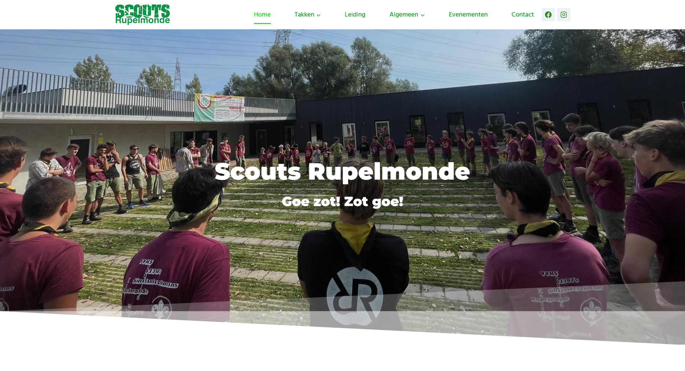

I currently serve as the **webmaster** for [Scouts Rupelmonde](https://scoutsrupelmonde.be), where I manage and develop the group’s official website. The site is built with **WordPress** and **Elementor**, giving us the flexibility to keep content up-to-date and the design accessible for everyone. It acts as the central information hub for our **members, parents, and supporters**.

---

## What the Website Offers

- **Group Pages (Per Age Section)**  
  Each section (or “tak”) has its own dedicated page with details on meeting times, leaders, and important dates like weekends and camps.

- **Events Calendar**  
  A clear and regularly updated calendar of upcoming events.

- **Contact Forms**  
  Easy-to-use forms for general questions.

- **Rental Information**  
  Details about the materials and spaces we rent out, including a request form.

- **Mobile-Friendly Design**  
  Fully responsive layout that works seamlessly across smartphones, tablets, and desktops.

---

## My Responsibilities

As webmaster, I handle both the **technical maintenance** and **content management**:

- Designing the layout and structure with Elementor
- Updating content for each age group and event
- Managing hosting, backups, and website performance
- Making ongoing improvements based on feedback from the team and visitors

---

## What I Learn from This Project

This role helps me sharpen my skills in **web design**, **WordPress development**, and **user-focused content creation**. I also gain valuable experience collaborating with a youth leadership team and building tools that serve a real community's needs.

---

👉 [**Visit the live website**](https://scoutsrupelmonde.be)

